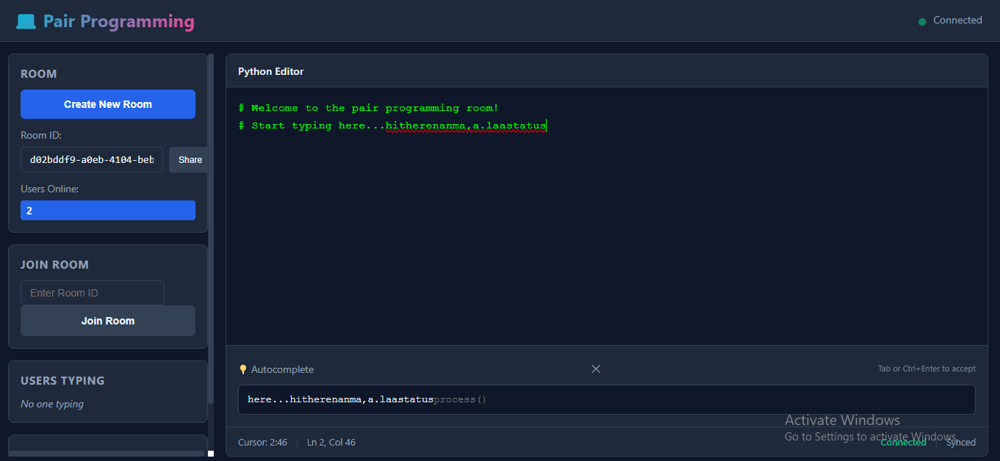

# Pair Programming Backend

A FastAPI backend for real-time collaborative code editing with WebSockets support.



## Features

✨ **Real-time Collaboration**
- WebSocket-based live code synchronization
- Cursor position tracking for multiple users
- Typing indicators
- In-memory room state management
- Last-write-wins conflict resolution

## Project Structure

```
backend/
├── main.py
├── core/
│   └── config.py           # Configuration and settings
├── db/
│   ├── database.py         # SQLite connection and DB utilities
│   └── models.py           # SQLAlchemy models (Room)
├── schemas/
│   ├── room.py             # Pydantic schemas for rooms
│   └── autocomplete.py     # Pydantic schemas for autocomplete
├── services/
│   ├── room_service.py     # Room business logic
│   └── realtime.py         # ConnectionManager and RoomState
├── routers/
│   ├── rooms.py            # Room REST endpoints
│   ├── autocomplete.py     # Autocomplete endpoints
│   └── ws.py               # WebSocket endpoint
└── data/
    └── app.db              # SQLite database (auto-created)
```

## Installation

### Prerequisites
- Python 3.9 or higher
- pip package manager

### Setup
- [Getting started guide](./GETTING_STARTED.md)

### Features offered
- [Features](./FEATURES.md)

## API Documentation

### Interactive Docs
Once the server is running, visit:
- **Swagger UI**: http://localhost:8000/docs
- **ReDoc**: http://localhost:8000/redoc

### REST Endpoints

#### Health Check
```http
GET /health
```

Response:
```json
{
  "status": "healthy"
}
```

#### Create Room
```http
POST /api/rooms
```

Response (201 Created):
```json
{
  "room_id": "550e8400-e29b-41d4-a716-446655440000"
}
```

#### Get Room
```http
GET /api/rooms/{room_id}
```

Response:
```json
{
  "room_id": "550e8400-e29b-41d4-a716-446655440000",
  "created_at": "2024-12-03T10:30:00",
  "last_updated": "2024-12-03T10:35:00"
}
```

#### Autocomplete
```http
POST /api/autocomplete
Content-Type: application/json

{
  "code": "def my_function",
  "cursor_position": 15,
  "language": "python"
}
```

Response:
```json
{
  "suggestion": "(self):\n    pass",
  "context": "Context for python"
}
```

### WebSocket Endpoint

**URL**: `ws://localhost:8000/api/ws/{room_id}`

#### Message Types

**Client → Server:**

1. **Initialize** (on connection):
```json
{
  "type": "init",
  "userId": "user-123"
}
```

2. **Code Update**:
```json
{
  "type": "code_update",
  "userId": "user-123",
  "code": "def hello():\n    print('Hello')",
  "timestamp": 1701600600000
}
```

3. **Cursor Position**:
```json
{
  "type": "cursor_update",
  "userId": "user-123",
  "cursorPosition": 42
}
```

4. **Typing Indicator**:
```json
{
  "type": "typing",
  "userId": "user-123",
  "isTyping": true
}
```

**Server → Client:**

1. **Initial State** (on connect):
```json
{
  "type": "init",
  "code": "# Welcome to the pair programming room!",
  "language": "python"
}
```

2. **Code Broadcast**:
```json
{
  "type": "code_update",
  "code": "def hello():\n    print('Hello')",
  "user_id": "user-123",
  "timestamp": 1701600600000
}
```

3. **Cursor Broadcast**:
```json
{
  "type": "cursor_update",
  "user_id": "user-123",
  "cursor_position": 42
}
```

4. **Typing Broadcast**:
```json
{
  "type": "typing",
  "user_id": "user-123",
  "is_typing": true
}
```

5. **User Presence**:
```json
{
  "type": "user_joined",
  "user_id": "user-123",
  "active_users": 2
}
```

```json
{
  "type": "user_left",
  "user_id": "user-123",
  "active_users": 1
}
```

6. **Error**:
```json
{
  "type": "error",
  "message": "Invalid message format"
}
```

## Database Schema

### Room Table
```sql
CREATE TABLE rooms (
  id VARCHAR(36) PRIMARY KEY,
  created_at DATETIME NOT NULL DEFAULT CURRENT_TIMESTAMP,
  last_snapshot TEXT,
  last_updated DATETIME
);
```

The database is automatically initialized on application startup.

## Configuration

Edit `backend/core/config.py` to customize:

- **Database Path**: `DATABASE_PATH`
- **CORS Origins**: `CORS_ORIGINS`
- **API Prefix**: `API_V1_PREFIX`
- **Default Language**: `DEFAULT_LANGUAGE`
- **Default Code**: `DEFAULT_ROOM_CODE`

### Environment Variables

```bash
# Set custom database path
export DATABASE_PATH=/path/to/database.db

# Set CORS origins (space-separated)
export CORS_ORIGINS="http://localhost:3000 http://localhost:5173"
```

## Architecture & Design Choices

### Backend Architecture
- **Framework**: Python 3.9 FastAPI for high-performance async HTTP server
- **Database**: SQLite for room metadata persistence and optional code snapshots
- **State Management**: In-memory state for live data (cursor positions, typing indicators, code)

### Real-Time Synchronization
- **WebSocket Pattern**: One WebSocket endpoint per room with ConnectionManager pattern
- **Connection Management**: Centralized tracking of all active rooms and connected clients
- **Sync Strategy**: Last-write-wins for code updates - simplest approach for prototype, suitable for focused pair programming

### Frontend Architecture
- **UI Framework**: Vanilla HTML5 + CSS3 + JavaScript (no build tools)
- **Editor**: Textarea-based editor with syntax highlighting support
- **Real-Time Updates**: Debounced WebSocket messages (300ms for code, 500ms for cursor)
- **Autocomplete**: Context-aware Python suggestions with Tab/Ctrl+Enter to accept

### Message Protocol
- **Format**: JSON messages over WebSocket
- **Message Types**: `init`, `code_update`, `cursor_update`, `typing`, `user_joined`, `user_left`, `error`
- **Broadcasting**: Server broadcasts to all or specific clients per message type

## Scope for improvement

### Scaling & Performance
- **Redis Pub/Sub**: Enable horizontal scaling by broadcasting WebSocket messages across multiple FastAPI instances. Socket setup with redis adaptor
- **Redis Streams**: Store message history for late joiners to sync code and cursor state instantly

### Data Persistence & Recovery
- **Periodic Snapshots**: Auto-save code snapshots at regular intervals (every 30 seconds)
- **Message History**: Store edit history for recovery and audit trails

### Security & Access Control
- **Authentication**: User login/signup with JWT tokens or OAuth2
- **Room Permissions**: Private rooms with invite-only access control
- **Encryption**: End-to-end encryption for sensitive code
- **Audit Logging**: Track who made what changes and when
- **No Access Control**: No permissions or room privacy settings

### User Experience
- **Rich Editor**: Full Monaco Editor integration with syntax highlighting, themes, keybindings
- **Inline Autocomplete**: Show suggestions inline with real-time preview
- **Multi-Cursor Display**: Visual indicators for all users' cursors with live tracking
- **Presence Avatars**: User avatars and status indicators
- **Code Review Features**: Commenting, suggestions, diff view
- **Theme Support**: Dark/light themes with user preferences

## Limitations

### Scalability Limitations
- **Single Instance Only**: Current prototype runs on single FastAPI instance; in-memory state doesn't support horizontal scaling
- **No Fault Tolerance**: Server restart loses all active sessions and in-memory state

### Data Consistency
- **Last-Write-Wins Only**: Simple conflict resolution can overwrite edits in rapid simultaneous typing
- **No Edit History**: Late joiners can't see previous edits or code history
- **No Undo/Redo**: Changes to code are permanent within session

## References

- [FastAPI Documentation](https://fastapi.tiangolo.com/)
- [WebSockets with FastAPI](https://fastapi.tiangolo.com/advanced/websockets/)
